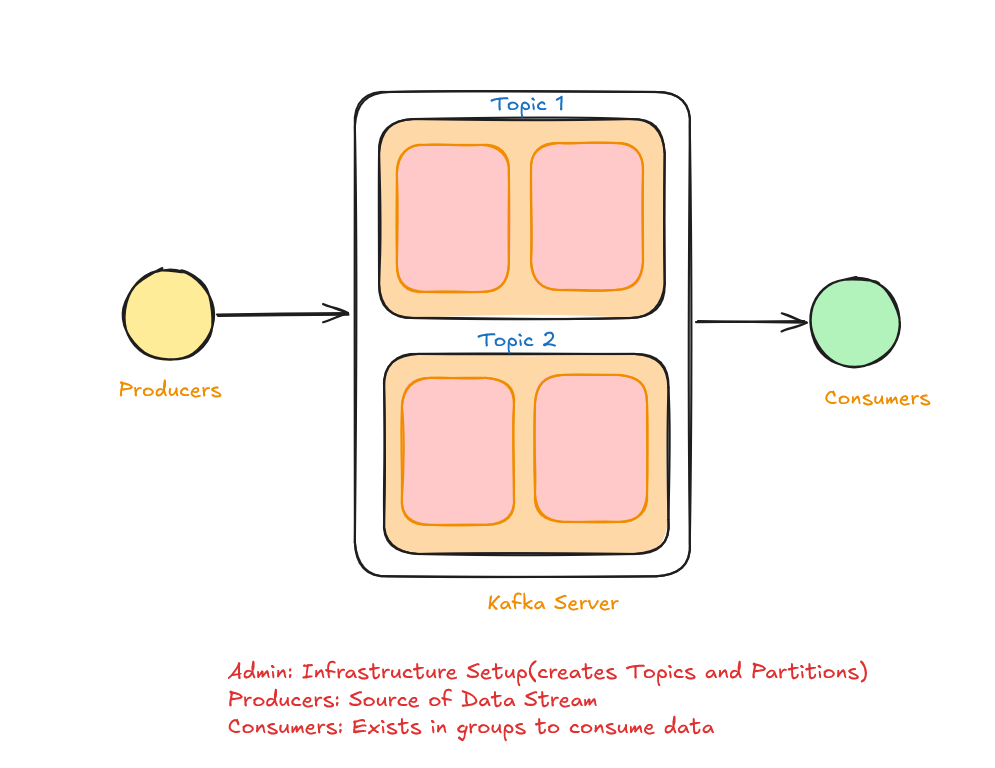
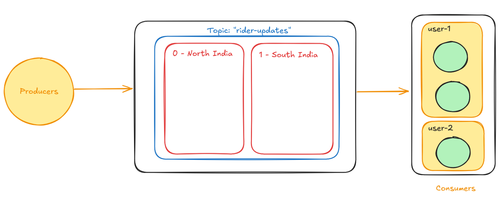

# Kafka: The Need Of The Hour

## Introduction
It is is an open-source distributed event streaming platform used for building real-time data pipelines and streaming applications. It is designed to handle high-throughput data streams and allows for the durable storage of messages in an append-only log

Since, the database has quite low througput => can perform quite less transactions per second(TPS), we need a streaming application which could act as a middleman storing all the data being generated at a quite high TPS. Hence, Kafka came into existence. It stores all the raw data produced by producers, accessible to consumers and flush them into our database in bulks at every fixed interval



## Can't Replace a Database, Why?
Even though Kafka has quite high TPS, it doesnot have the abiltity to store a large amount of data over a long duration

Also Kafka doesnot support querying of data unlike a general database

## Pre-requisites to run this project
- Docker (a must, installed on your PC)
- Basic Knowledge of NodeJS (what are even doing here, if you lack this)

To run this project: <br/>
We require images of `Zookeeper` and `Kafka`
I know the latest versions of Kafka has stripped it's dependency from `Zookeeper` and do all the lifting alone but I am sticking with the legacy behaviour here

## Spinning up the container

### Zookeeper
```bash
 docker run -d -p 2181:2181 --name zookeeper zookeeper
```

<b>A crucial note:</b> <br/>
 Fo me the port `2181` was coming out to be in use (yes did the <br/>
 `netstat -ano | findstr :2181` <br/>
 still nothing came up)

 If you end up facing the same issue, use this one instead
```bash
 docker run -d -p 8080:2181 --name zookeeper zookeeper
``` 

### Kafka
```bash
docker run -p 9092:9092 `
-e KAFKA_ZOOKEEPER_CONNECT=192.168.29.234:2181 `
-e KAFKA_ADVERTISED_LISTENERS=PLAINTEXT://192.168.29.234:9092 `
-e KAFKA_OFFSETS_TOPIC_REPLICATION_FACTOR=1 `
confluentinc/cp-kafka:7.2.1
```

## Onto the finals
### Clone the repository
```bash
git clone https://github.com/SecondMikasa/Kafka-Node.git

cd Kafka-Node
```

### Install necessary packages
```bash
npm install
or
bun install
```

### Running the project
Get two terminal open <br/>
In one, use `node .\consumer.js <group_name>` <br/>
In another, use `node .\producer.js` and enter the details in following manner after `>`

```bash
<Name_Of_Driver> <Location (North | South)>
```



### All set, do experiments and enjoy